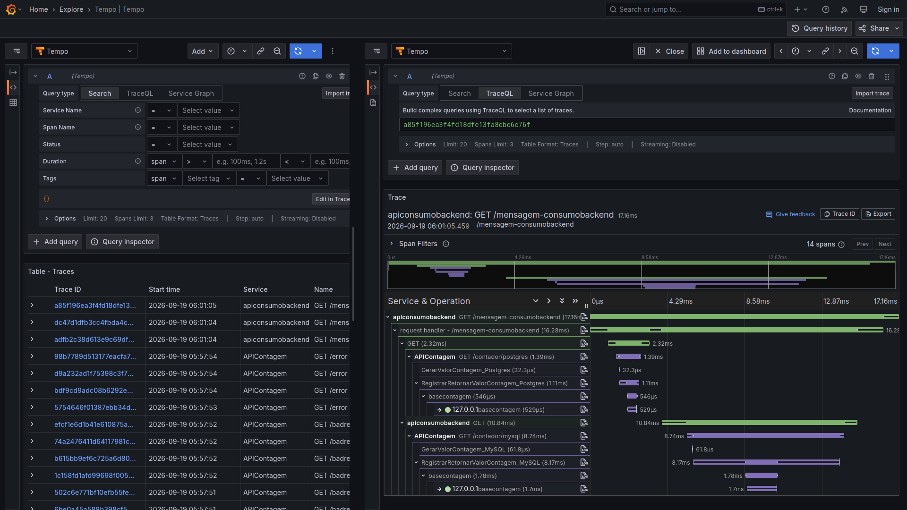

# nodejs-otel_apiconsumobackend-v2
Exemplo de API REST criada com o Node.js e utilizando Distributed Tracing OpenTelemetry (configurando porta do Collector) e consumindo 2 endpoints de uma API REST de contagem de acessos. Para uso com ambientes empregados em testes de observabilidade e disponibilizados via Docker Compose.

API REST consumida por este projeto: **https://github.com/renatogroffe/aspnetcore10-otel-grafana-tempo-loki-prometheus-postgres-mysql-testcontainers_contagemacessos**

## Testes

Trace gerado no Grafana Tempo:

